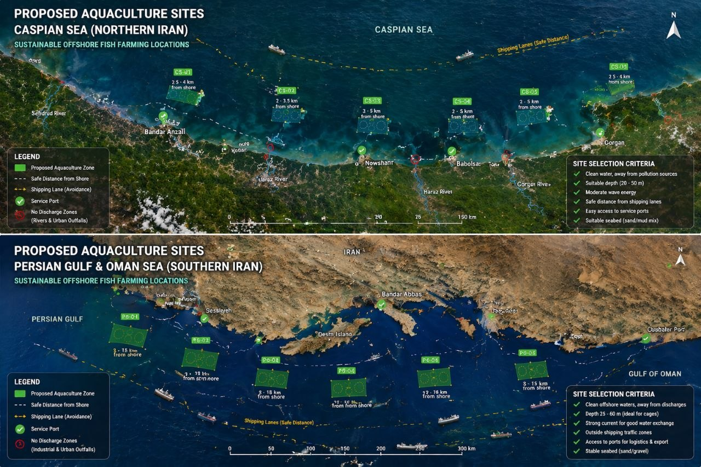
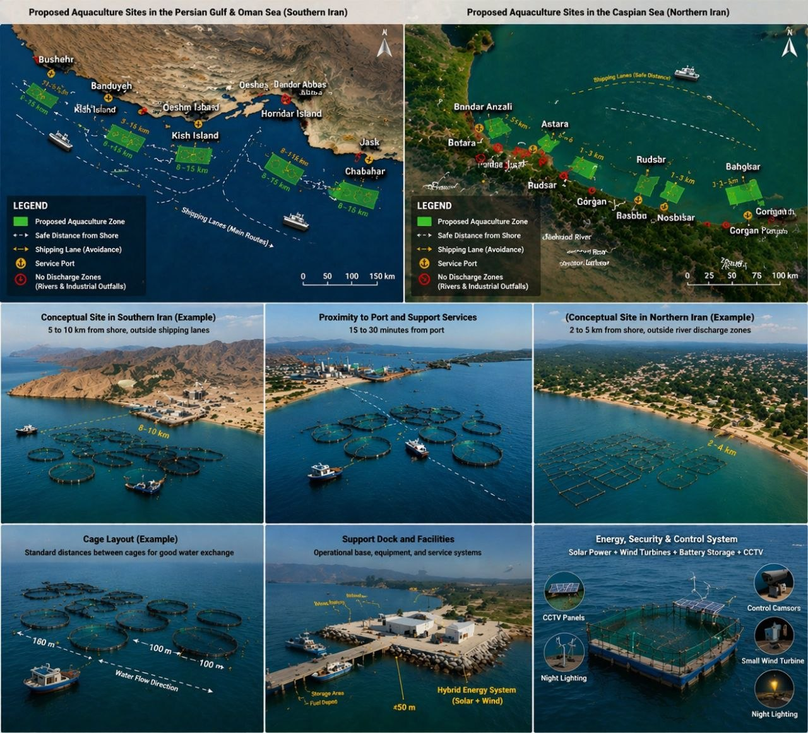
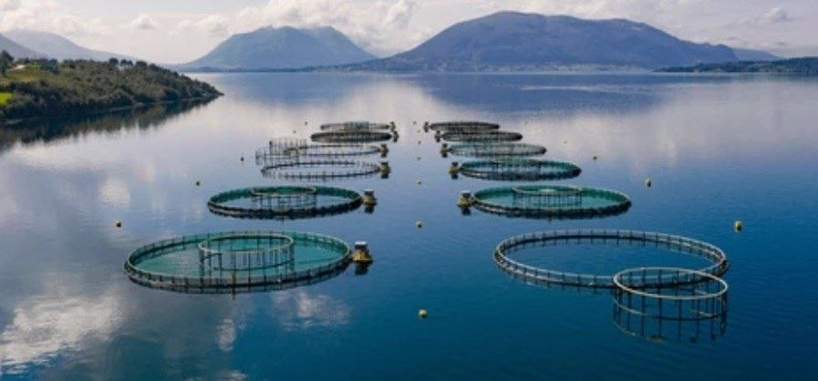
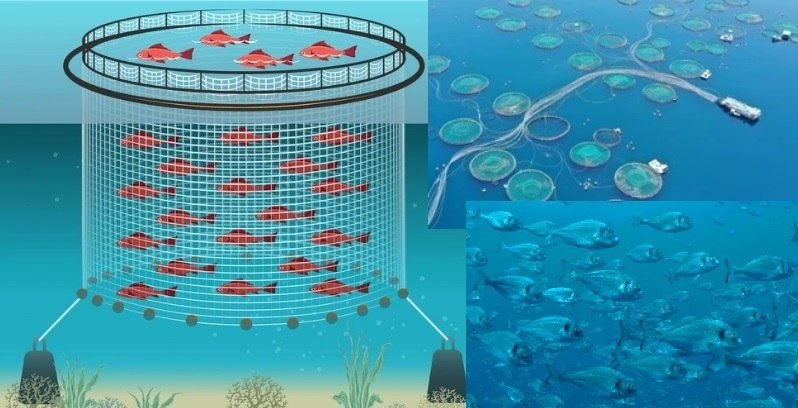
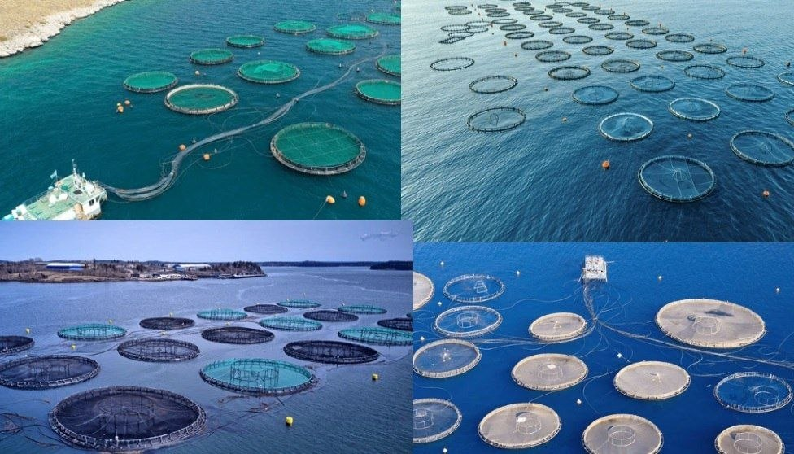

# Iran Aquaculture Project

## Executive Summary

This project presents a scalable and investment-oriented aquaculture development plan focused on offshore fish farming in Iran.

The project targets two strategic marine regions:
- The Caspian Sea (Northern Iran)
- The Persian Gulf & Oman Sea (Southern Iran)

The goal is to develop high-efficiency fish farming systems that reduce production costs, optimize logistics, and generate export-driven revenue.

---

## Strategic Vision

The project is designed to:
- Reduce dependency on seafood imports
- Increase domestic production capacity
- Build export-oriented aquaculture infrastructure
- Generate sustainable long-term revenue
- Contribute to national economic growth and foreign currency inflow

---

## Site Selection Strategy (Macro View)

This map provides a strategic overview of suitable aquaculture zones across Iran.

Key considerations:
- Distance from shipping lanes
- Clean offshore water zones
- Access to ports and logistics
- Regional scalability potential

---

## Operational Site Planning (Detailed View)

This map shows a more detailed operational perspective, including:
- Precise offshore distances
- Safe positioning relative to maritime routes
- Environmental considerations (pollution avoidance)
- Practical deployment feasibility

This layer confirms that the project is not only conceptual but also operationally viable.

---

## Cage System Overview

The project utilizes offshore floating cage systems designed for:
- Continuous water exchange
- Healthy fish density management
- Modular scalability
- Reduced environmental impact

---

## Cage Engineering Design

Each cage is engineered with:
- High-durability floating structures
- Optimized net depth and geometry
- Anchoring and mooring systems
- Efficient water circulation design

---

## Farm Layout & Infrastructure

The farm layout is designed to:
- Maximize production efficiency per unit area
- Enable centralized feeding and monitoring
- Optimize vessel movement and logistics
- Reduce operational costs

---

## Financial Logic & Investment Perspective

The project is structured around strong financial fundamentals:

### Cost Optimization
- Reduced logistics costs due to strategic location
- Efficient feed utilization (FCR optimization)
- Lower infrastructure cost per production unit
- Scalable operational design

### Revenue Potential
- High-demand seafood markets (domestic + export)
- Stable pricing in aquaculture sector
- Large-scale production capability

### Value Creation
- Job creation in coastal regions
- Development of marine industrial infrastructure
- Foreign currency generation through export
- Contribution to national GDP growth

---

## Scalability

The project is designed for phased expansion:

- Phase 1: Pilot implementation
- Phase 2: Regional expansion
- Phase 3: Industrial-scale aquaculture clusters

---

## Conclusion

This project represents a high-potential investment opportunity combining:

- Strategic location selection
- Engineering efficiency
- Operational feasibility
- Strong financial logic
- Long-term scalability

It is positioned to become a key player in regional aquaculture development and export markets.
